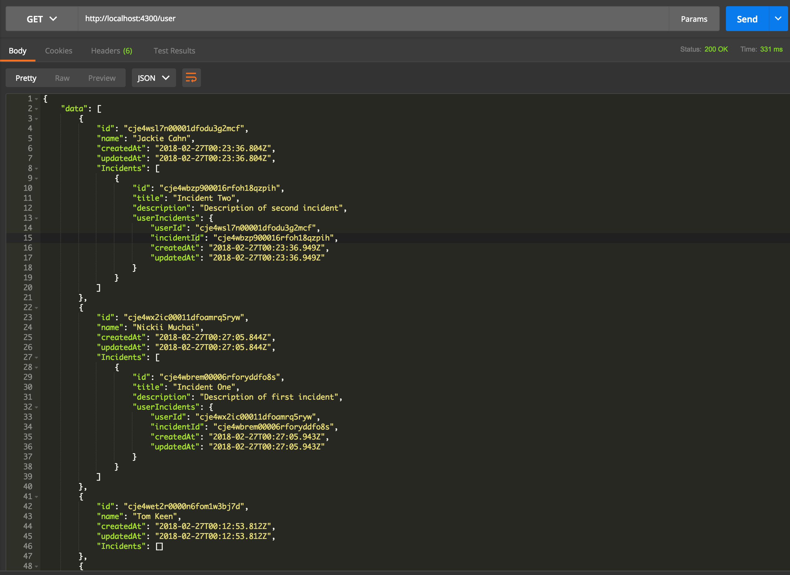

# SQLize-Sample
Sample Using Join Table

## Testing Output

> Create Incident

> Create User

Copy the ID of the created incident and use to create a User with an attached incident.

> DB automatically updates the JOIN table

> Query Users with attached incidents

